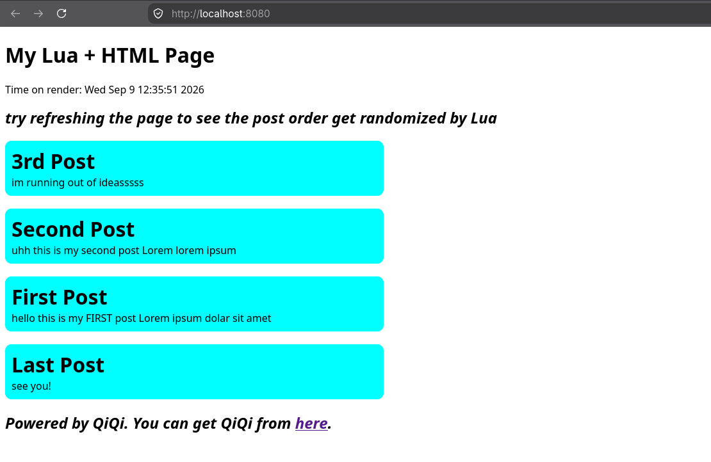

# QiQi
A http web server+framework written in C, utilising Lua as it's scripting language.




This project contains [the web server](/src/server.c), [the Lua runtime](/src/cgi.c) and [the LUAJSX transpiler](/src/transpiler.c).

LJSX is a custom language inspired by [JSX](https://github.com/facebook/jsx). It uses Lua instead of JavaScript. 

Here's a showcase of it's syntax:
```lua
function Index() 
    <h1>You can write HTML anywhere you want!</h1>
    local lang = "Lua"
    <div>And you can write {{lang}} inside HTML</div>
end
```

## Prerequisites

- [Lua](https://www.lua.org/) 5.4 development library (`liblua5.4-dev`)
- A C compiler

## Usage

1. Clone the repository:

```bash
git clone https://github.com/erenaywastaken/qiqi.git
cd qiqi
```

2. Run setup script
```bash
chmod +x setup.sh
./setup.sh
```
The setup script will compile everything, transpile your LJSX files in `site/` and run the server.
There's a demo webpage in `site/` by default.

### AI usage in project:
Help with debugging the transpiler.